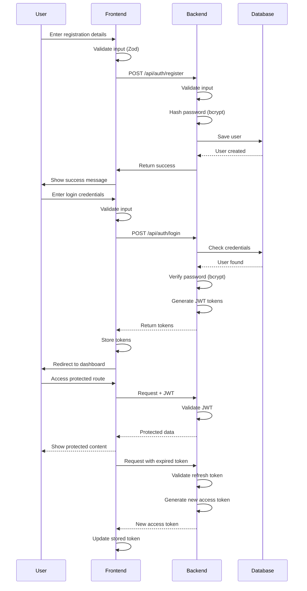

# Authentication Flow

## Overview

This document describes the authentication flow in the SkillWise AI Tutor application.



## Security Features

1. **Password Security**

   - Passwords are hashed using bcrypt with 12 rounds
   - Password requirements:
     - Minimum 8 characters
     - At least one uppercase letter
     - At least one lowercase letter
     - At least one number
     - At least one special character

2. **Token Security**

   - Access tokens expire after 15 minutes
   - Refresh tokens expire after 7 days
   - Tokens are stored in httpOnly cookies
   - CSRF protection enabled

3. **API Security**
   - Rate limiting enabled (100 requests per 15 minutes)
   - CORS configured for frontend origin
   - Secure HTTP headers
   - Input validation using Zod

## Implementation Details

### JWT Configuration

```javascript
{
  "access_token": {
    "expiry": "15m",
    "algorithm": "HS256"
  },
  "refresh_token": {
    "expiry": "7d",
    "algorithm": "HS256"
  }
}
```

### Database Schema

```sql
CREATE TABLE users (
  id SERIAL PRIMARY KEY,
  email VARCHAR(255) UNIQUE NOT NULL,
  password_hash VARCHAR(255) NOT NULL,
  role VARCHAR(20) DEFAULT 'student',
  is_active BOOLEAN DEFAULT true,
  created_at TIMESTAMP WITH TIME ZONE DEFAULT CURRENT_TIMESTAMP
);

CREATE TABLE refresh_tokens (
  id SERIAL PRIMARY KEY,
  user_id INTEGER REFERENCES users(id),
  token VARCHAR(255) UNIQUE NOT NULL,
  expires_at TIMESTAMP WITH TIME ZONE NOT NULL,
  created_at TIMESTAMP WITH TIME ZONE DEFAULT CURRENT_TIMESTAMP
);
```
